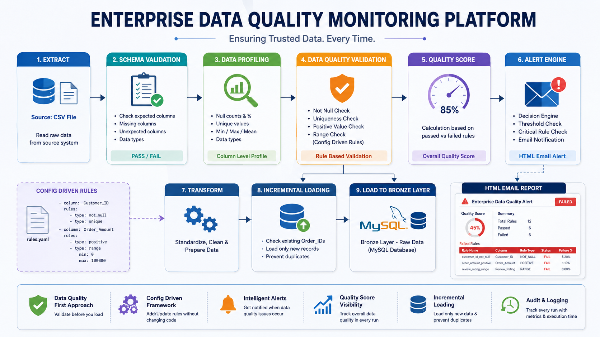
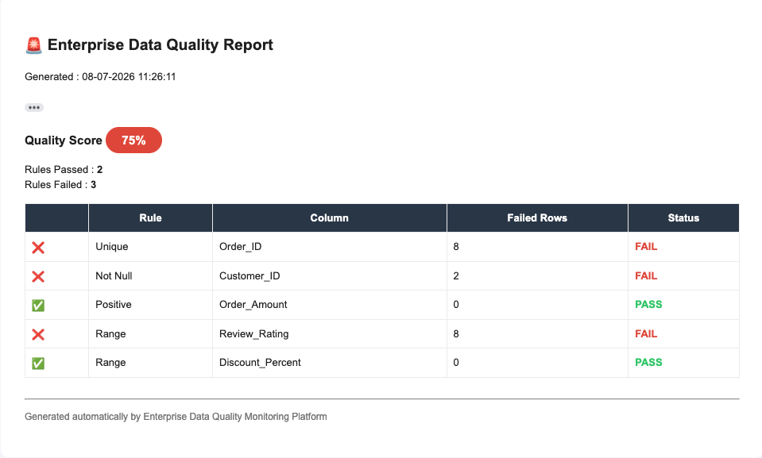

# Enterprise Data Quality Monitoring Platform



## Overview

The Enterprise Data Quality Monitoring Platform is a Python-based ETL and Data Quality Framework designed to simulate how enterprise organizations monitor, validate, and ingest data before it is consumed by downstream analytics systems.

Instead of focusing only on reporting, this project emphasizes **data reliability**, **validation**, **automation**, and **quality monitoring**.

---

## Features

### ETL Pipeline

* Extract data from CSV
* Transform dataset into standardized format
* Load validated data into MySQL Bronze Layer

### Schema Validation

* Verify expected columns
* Detect missing columns
* Detect unexpected columns
* Stop pipeline if schema validation fails

### Data Profiling

* Column data types
* Null value analysis
* Unique value counts
* Minimum, Maximum and Mean statistics
* Automatic profiling before loading

### Rule-Based Validation Engine

Configurable validation rules using YAML.

Supported rules include:

* Not Null
* Unique
* Positive Values
* Range Validation

### Data Quality Score

Automatically calculates an overall quality score based on validation results.

### Intelligent Alert System

* Alert Decision Engine
* Professional HTML Email Reports
* Gmail SMTP Integration
* Critical rule detection
* Quality score threshold alerts



### Incremental Loading

Prevents duplicate data ingestion by comparing incoming Order_ID values with existing Bronze layer records.

---

## Tech Stack

* Python
* Pandas
* MySQL
* SQLAlchemy
* YAML
* HTML
* Gmail SMTP
* Git
* GitHub

---

## Project Workflow

CSV Dataset

↓

Extract

↓

Schema Validation

↓

Data Profiling

↓

Rule Validation Engine

↓

Quality Score Calculation

↓

Alert Decision Engine

↓

Incremental Loading

↓

Bronze Layer (MySQL)

---

## Folder Structure

```text
app/
    alerts/
    etl/
    profiling/
    validation/
    services/
    models/

config/

database/

data/

reports/

logs/
```

---

## Future Enhancements

* Silver Layer
* Gold Layer
* Data Drift Detection
* Rejected Records Management
* Power BI Monitoring Dashboard
* Historical Quality Trend Analysis

---

## Key Learning Outcomes

* ETL Pipeline Design
* Data Quality Engineering
* Incremental Loading
* Schema Validation
* Config-Driven Rule Engines
* Automated Email Alerting
* Enterprise Project Architecture

---

## Author

Shiv Nandan Jha

If you found this project useful, feel free to connect or provide feedback.
